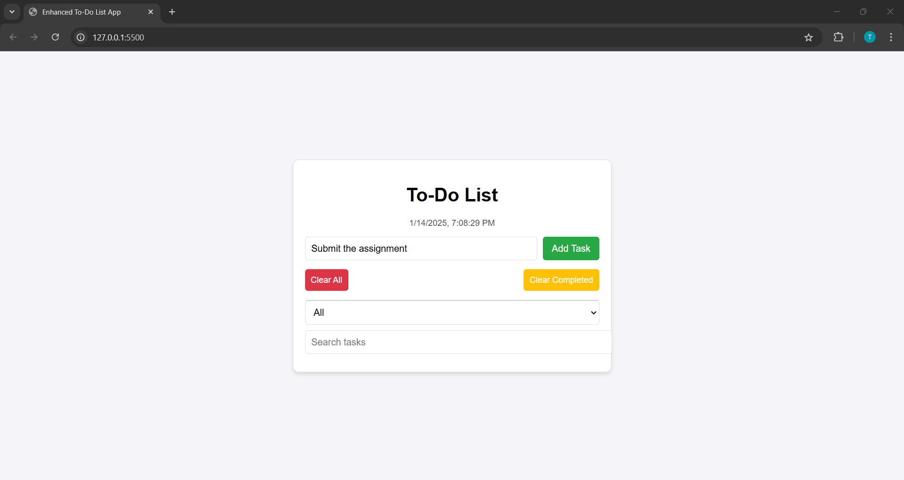
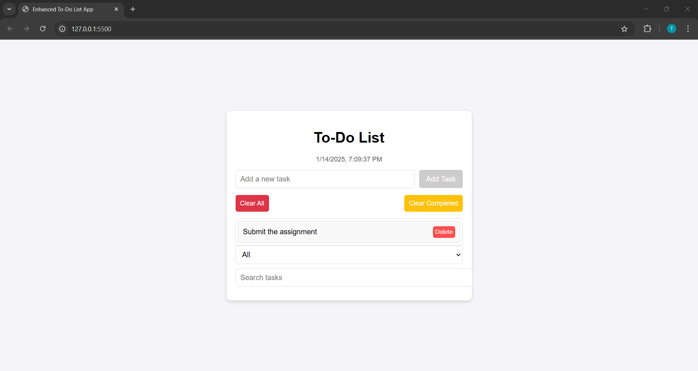
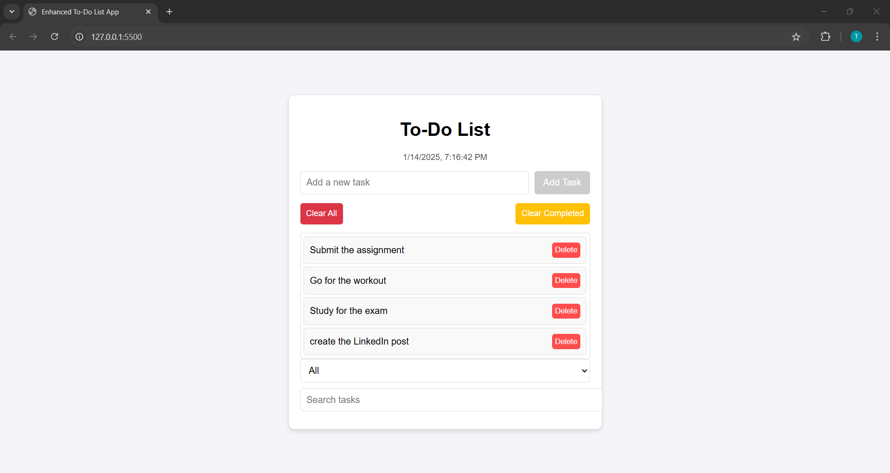
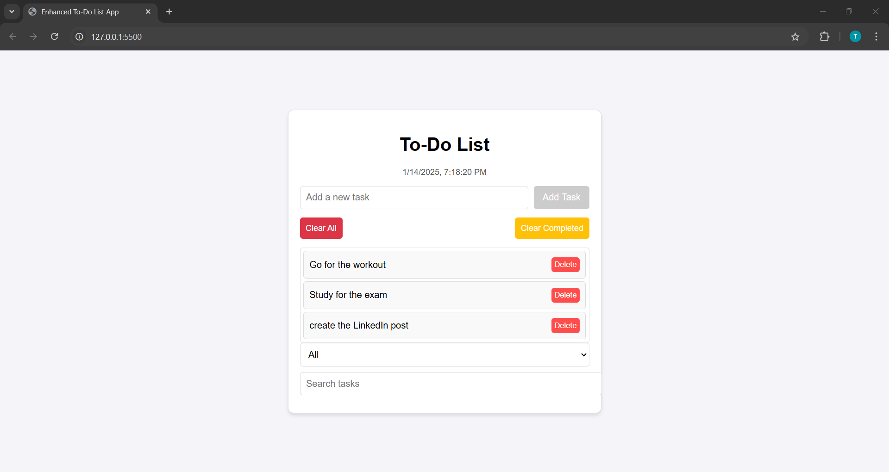
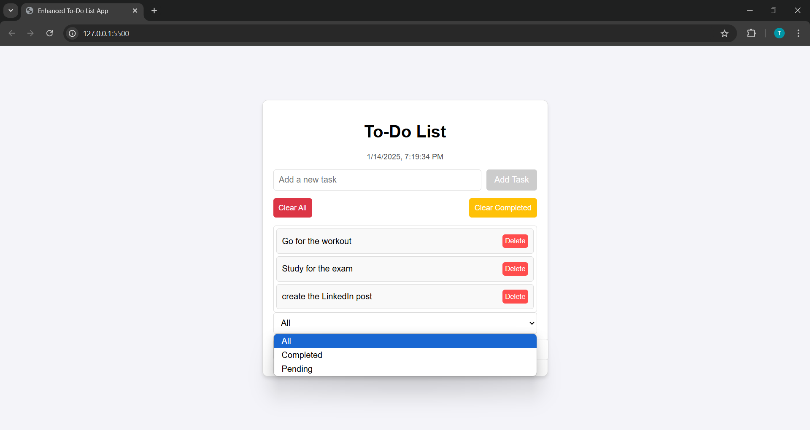
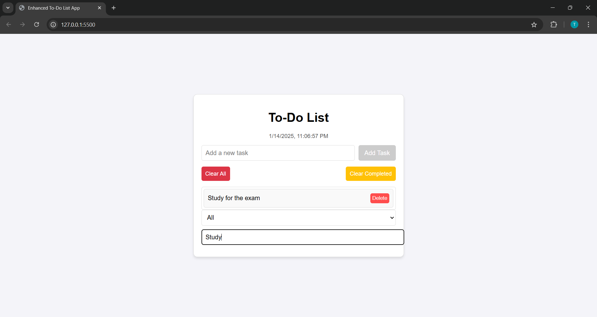
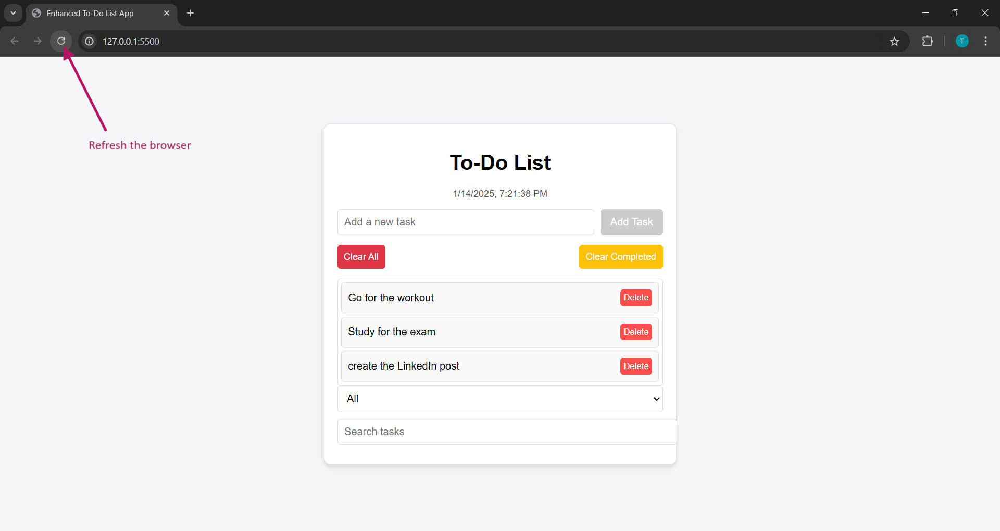

# 📝 To-Do List App

A simple yet powerful To-Do List application built using **HTML**, **CSS**, and **JavaScript**. This app helps you manage your daily tasks efficiently with features like adding, removing, filtering, and searching tasks. The app also supports local storage, so your tasks persist even after refreshing the page.

## ✨ Features

- **➕ Add Tasks**: Add new tasks with a single click.  
- **❌ Delete Tasks**: Remove tasks individually or clear all tasks at once.  
- **✔️ Mark as Completed**: Toggle tasks as completed by clicking on them or toggle it back to pending. 
- **🔍 Filter Tasks**:  
  - 🗂️ View all tasks.  
  - ✅ View only completed tasks.  
  - ⏳ View only pending tasks.  
- **🔎 Search Tasks**: Quickly find tasks using the search bar.  
- **💾 Persistent Storage**: Tasks are saved in the browser's local storage, so they are not lost on page refresh.  
- **⏰ Dynamic Date & Time**: Displays the current date and time, updated in real-time.  

## 🌐 Demo

You can try the live version of the app here: [To-Do List App Demo](https://thesanyaw.github.io/To-Do-List-App/)

## 🛠️ Installation

1. Clone the repository:  
   ```bash
   git clone <repository-url>
   ```
2. Navigate to the project directory:  
   ```bash
   cd to-do-list-app
   ```
3. Open the `index.html` file in your browser to start using the app.

## 🚀 Usage

1. ✏️ Enter a task in the input field and click the **Add Task** button to add it to the list.  
2. 👆 Click on a task to mark it as completed or toggle it back to pending.  
3. 🗑️ Use the **Delete** button to remove a specific task.  
4. 🧹 Use the **Clear All** button to delete all tasks.  
5. ✅ Use the **Clear Completed** button to remove only completed tasks.  
6. 🔽 Use the **Filter** dropdown to filter tasks based on their status (All, Completed, Pending).  
7. 🔍 Use the **Search** bar to find tasks by their name.

## 📁 Project Structure

```
├── index.html   # Main HTML file
├── style.css    # Stylesheet for the app
├── script.js    # JavaScript for app functionality
└── README.md    # Project documentation
```

## 📸 Screenshots

### 📋 Overview of the App  
  

### ➕ Add Tasks  
  

### ✔️ Tasks Mark as Completed  
  

### 🔄 Toggle Back to Pending  
  

### ❌ Delete Tasks  
  

### 🔽 Filter Tasks  
  

### 🔎 Search Tasks  
  

### 💾 Persistent Storage  
  

## 🤝 Contributions

Contributions are welcome! Feel free to open an issue or submit a pull request.  

## 📝 License

This project is licensed under the MIT License. See the [LICENSE](LICENSE) file for details.

## 🙌 Acknowledgments

- 🛠️ Inspired by the simplicity and productivity of modern to-do apps.  
- 📚 Developed as part of a Web Development Bootcamp.

---

🌟 **Start managing your tasks effectively with this lightweight and user-friendly To-Do List App!**
```
